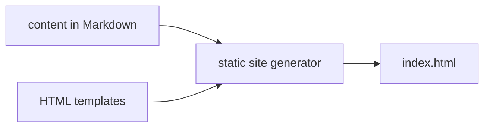
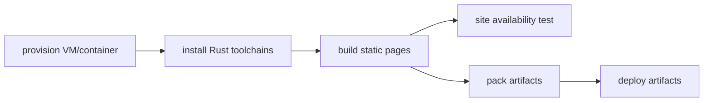

# Static site generator
Implemented using Rust (actually not implemented at all).

```mermaid
    flowchart LR;
    A[content in Markdown]-->B[static site generator];
    C[HTML templates]-->B;
    B-->D[index.html];
```

# CI/CD
Implemented using Gihub workflows feature.
Build stages:

```mermaid
    flowchart LR;
    A[provision VM/container]-->B[install Rust toolchains];
    B-->C[build static pages];
    C-->D[site availability test];
    C-->E[pack artifacts];
    E-->F[deploy artifacts];
```
