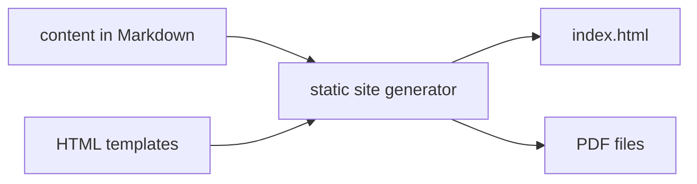
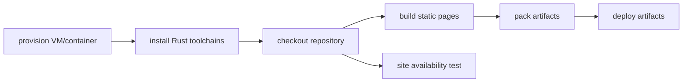

# Static site generator
Implemented using Rust (actually not implemented at all).



# CI/CD
Implemented using Gihub workflows feature.
Build stages:



# render HTML into PDF
In order to use `wkhtmltopdf` crate eponymous utility should be
installed on a building platform.

## Arch Linux
```bash
sudo pacman -S wkhtmltopdf
```

## Ubuntu
```bash
wget https://github.com/wkhtmltopdf/packaging/releases/download/0.12.6-1/wkhtmltox_0.12.6-1.focal_amd64.deb
sudo apt install ./wkhtmltox_0.12.6-1.focal_amd64.deb
```
