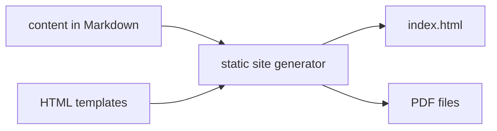
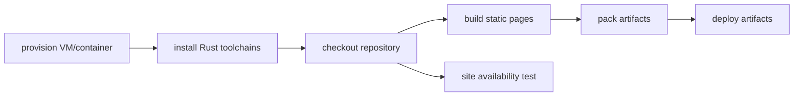

<div align="center">

[](https://github.com/enkron/enkron.github.io/actions)

</div>

# Static site generator

Rust-based static site generator that converts Markdown to HTML and PDF. Includes CLI for content management and WASM-powered dark mode.



## Usage

### Build site
Generate HTML and PDF files from Markdown sources:
```bash
cargo run --release
```

### Add blog entry
Create a new entry in `in/entries/` and update `in/junkyard.md`:
```bash
cargo run --release -- add "Entry Title"
```

Entry filename format: `N-entry-title.md` where `N` is auto-incremented.

### CLI reference
```bash
enkronio [COMMAND]

Commands:
  add <TITLE>    Add a new blog entry
  help           Print help information

Options:
  -h, --help     Print help
```

## Project structure

```
in/
├── entries/           Blog entries (numbered: 1-title.md, 2-title.md, ...)
├── cv.md             CV (→ root/cv.html + download/sbelokon.pdf)
├── index.md          Cover page (→ root/index.html + download/cover.pdf)
└── junkyard.md       Blog index page

pub/
├── entries/          Generated entry HTML (1.html, 2.html, ...)
└── junkyard.html     Blog index HTML

download/             Generated PDFs
```

## Development

### Build and serve locally
```bash
make site
```
Builds WASM module, generates site, serves on `http://localhost:8080`.

### Build WASM module
```bash
wasm-pack build --target web --out-dir web/pkg
```

### Clean artifacts
```bash
make clean
```

### Code quality
```bash
cargo check
cargo clippy
```

# CI/CD
Implemented using Gihub workflows feature.
Build stages:


