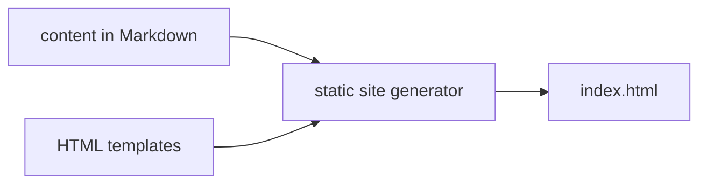

# Static site generator
implemented using Rust (actually not implemented at all).

```mermaid
    flowchart LR;
    A[content in Markdown] --> B[static site generator];
    C[HTML templates]-->B;
    B-->D[index.html];
```
