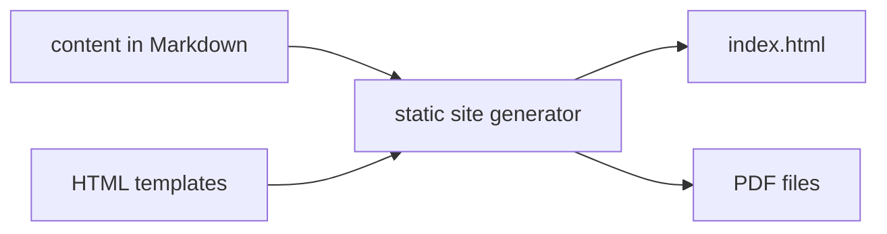
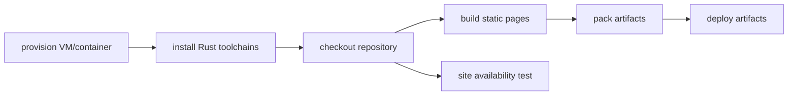

<div align="center">

[](https://github.com/enkron/enkron.github.io/actions)

</div>

# Static site generator

Rust-based static site generator that converts Markdown to HTML and PDF. Includes CLI for content management and WASM-powered dark mode.



## Usage

### Build site
Generate HTML and PDF files from Markdown sources:
```bash
cargo run --release
```

### Add blog entry
Create a new entry in `in/entries/` and update `in/junkyard.md`:
```bash
cargo run --release -- add "Entry Title"
```

Entry filename format: `N-entry-title.md` where `N` is auto-incremented.

### Add shadow entry (private)
Create a private entry that's not listed in `junkyard.md`:
```bash
cargo run --release -- add --shadow "Private Entry"
```

Shadow entries:
- Stored in `in/entries/shadow/` (independent numbering)
- Output to `priv/entries/N.html` (separate from `pub/`)
- Accessible via `/priv/entries/N.html` URLs
- Not added to junkyard index
- Navigation links only to other shadow entries

### CLI reference
```bash
enkronio [COMMAND]

Commands:
  add [OPTIONS] <TITLE>    Add a new blog entry
  help                     Print help information

Options for add:
  --shadow                 Create as shadow entry (private, not listed)
  -h, --help              Print help
```

## Project structure

```
in/
├── entries/           Blog entries (numbered: 1-title.md, 2-title.md, ...)
│   └── shadow/       Private entries (not in junkyard)
├── cv.md             CV (→ root/cv.html + download/sbelokon.pdf)
├── index.md          Cover page (→ root/index.html + download/cover.pdf)
└── junkyard.md       Blog index page

pub/
├── entries/          Generated entry HTML (1.html, 2.html, ...)
└── junkyard.html     Blog index HTML

priv/
└── entries/          Generated shadow entry HTML (1.html, 2.html, ...)

download/             Generated PDFs
```

## Development

### Build and serve locally
```bash
make site
```
Builds WASM module, generates site, serves on `http://localhost:8080`.

### Build WASM module
```bash
wasm-pack build --target web --out-dir web/pkg
```

### Clean artifacts
```bash
make clean
```

### Code quality
```bash
cargo check
cargo clippy
```

### Git hooks
Install pre-push hook to validate code quality before pushing:
```bash
./hooks/install-hooks.sh
```

Pre-push hook runs automatically before `git push` and checks:
- Code formatting (`cargo fmt`)
- Linting (`cargo clippy`)
- Test suite (`cargo test`)

To bypass hook (not recommended):
```bash
git push --no-verify
```

# CI/CD
Implemented using Gihub workflows feature.
Build stages:


